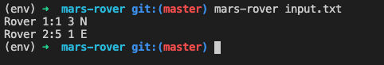

# Mars Rover

## Requirements

Python 3.6+.

- To use [f-strings](https://www.python.org/dev/peps/pep-0498/), I use python 3.6 version or high version.

pip

- To install packages, we need to use [pip](https://pypi.org/project/pip/). Please install pip in your local.

## Install application and running the application

Please clone this code repository on your local environment first. <br>
To run the application, please run the following commands. I highly recommend to create the [python virtual env](https://docs.python.org/3.6/tutorial/venv.html).

```
# (Step 1) To create the python virtual environment.
$ python3 -m venv env
# (Step 2) To activate the python virtual environment.
$ source env/bin/activate
# (Step 3) Install the application.
$ python3 -m pip install --editable .
# (Step 4) Run the application. The application name is mars-rover.
$ mars-rover input.txt
```

The first parameter of the application is the input file. So you can input the your input file path. The following image is the example of the application result. <br>


## Setting a development environment.

To set a dev environment for this project, please run the following commands. I highly recommend to use the [python virtual env](https://docs.python.org/3.6/tutorial/venv.html) to create your dev environment. If you already created the virtual env, you can skip the step 1.

```
# (Step 1) To create the python virtual environment.
$ python3 -m venv env
# (Step 2) To activate the python virtual environment.
$ source env/bin/activate
# (Step 3) Install dev packages.
$ pip install -r requirements.txt
# (Step 4) Install the application package.
$ pip install --editable .
```

### Unit testing

Unit testing is performed with [pytest](https://pytest.org).

```
# To run unit test codes.
$ pytest
```

### To create a new commit

To create a new commit, you should pass the [pre-commit](https://pre-commit.com) checks. After pass the checks, you could create a new commit. The pre-commit is configured by .pre-commit-config.yaml

```
$ pre-commit install
```
